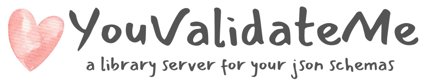

# YouValidateMe

<p align="center">
  
</p>

YouValidateMe is an HTTP server that validates inbound JSON data against JSON schemas. It's written in Golang.

Put your JSON Schema documents on the server and then submit JSON data to validate against those JSON Schemas.

Why? To centralise field validation logic for your applications instead of scattering different validation logic everywhere that might get out of sync.

It's a single binary - nothing to install or configure though we do provide a systemd unit file to run it as a service.

## IMPORTANT!!!

YouValidateMe is brand new and is not battle tested (or tested at all!). You should read the Go source code before using it (it's a single file of less than 500 lines, won't take long to read) and you should test it to your satisfaction before relying on it. There is no guarantee at all - use at your own risk.

## How to use it in your applications.

There is a binary file named youvalidateme in this repo which is compiled for Linux AMD64 - you'll need to compile it yourself if you are using other platforms.

There is a Python file in the examples directory that illustrates how you would use YouValidateMe from within your own application.  If you are using a different language then look at the Pyuthon code anyway - it is simple to understand and you can easily transfer the principles to your preferred programming language or ask ChatGPT to convert it.

## Features

- **Validate JSON Data**: Validate inbound JSON data against specified schemas.
- **Retrieve Validation Statistics**: Retrieve statistics on inbound paths and JSON schema validation passes/fails.
- **Schema Management**: Retrieve and upload JSON schemas (if uploads are allowed).
- **List Schemas**: List all available JSON schemas in the specified directory.

## Requirements

- Go 1.15 or later

## Installation

Clone the repository:

```sh
git clone https://github.com/yourusername/youvalidateme.git
cd youvalidateme
```

Build the server:

```sh
go build -o youvalidateme youvalidateme.go
```

## Usage

Start the server with default options:

```sh
./youvalidateme
```

Start the server with custom options:

```sh
./youvalidateme --port 8080 --schemas-dir=/path/to/schemas --allow-uploads
```

### Command-line Options

- `--hostname`: Hostname to bind the server (default: `localhost`)
- `--port`: Port to bind the server (default: `8080`)
- `--schemas-dir`: Directory to load JSON schemas from (default: `./schemas`)
- `--allow-uploads`: Allow schema uploads (default: `false`)

## Endpoints

### Validate JSON Data

Validate JSON data against the specified schema.

```sh
curl -X POST -d '{"your":"data"}' http://localhost:8080/validate/your_schema.json
```

### Retrieve Validation Statistics

Retrieve statistics on inbound paths and JSON schema validation passes/fails.

```sh
curl http://localhost:8080/stats
```

### Retrieve a Schema

Retrieve the specified schema.

```sh
curl http://localhost:8080/schema/your_schema.json
```

### Upload a New Schema

Upload a new JSON schema (only if uploads are allowed).

```sh
curl -X POST -d '{"$schema":"http://json-schema.org/draft-07/schema#","title":"Example","type":"object","properties":{"example":{"type":"string"}}}' http://localhost:8080/schema/your_schema.json
```

### List All Schemas

List all JSON schemas in the schemas directory.

```sh
curl http://localhost:8080/schemas
```

List all JSON schemas in the schemas directory in JSON format.

```sh
curl http://localhost:8080/schemas?format=json
```

## Development

### Running the Server

To run the server locally for development purposes, use:

```sh
go run youvalidateme.go
```

### Testing

To test the server, you can use the provided curl commands to interact with the various endpoints.

## Contributing

Contributions are welcome! Please open an issue or submit a pull request for any improvements or bug fixes.

## License

This project is licensed under the MIT License. See the [LICENSE](LICENSE) file for details.

